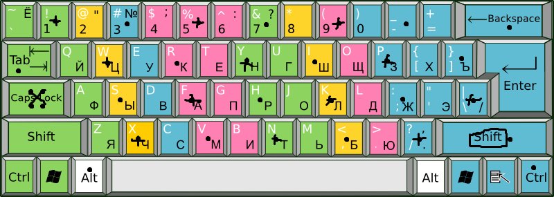

<a name="top"></a>
<a class=top-link hide href="#top">↑</a>

<style type="text/css">
   .top-link {
    transition: all .25s ease-in-out;
    position: fixed;
    bottom: 0;
    right: 0;
    display: inline-flex;
    color: #000000;

    cursor: pointer;
    align-items: center;
    justify-content: center;
    margin: 0 2em 2em 0;
    border-radius: 50%;
    padding: .25em;
    width: 1em;
    height: 1em;
    background-color: #F8F8F8;
}

h1{
    color: rgb(155, 0, 218);
    font-weight: normal;
    font-style: italic;
    font-weight:bold;

}
h2{
    color: rgb(155, 40, 238);
    font-style: italic;
    font-weight:bold;
}
h3{
    color: rgb(155, 80, 218);
    font-style: italic;
    font-weight:bold;
}
h4{
    color: rgb(155, 120, 218);
    font-style: italic;
    font-weight:bold;
}
h5{
    color: rgb(155, 160, 218);
    font-style: italic;
    font-weight:bold;
}
h6 {
    color: rgb(155, 200, 230);
    font-style: italic;
    font-weight:bold;
}
</style>

Start Contents Menu

<!-- STOC  --> 

- <a href=#UajjEZErsCeZsg04tHtqZRPAiLYSWlLB> ## that file1.code head </a>
- <a href=#sVcxI1KelQyqpFC5CuOQwQgZ2ISY26WO> ## that file1.txt head </a>
- <a href=#60rQr3boBFiwCRXE3V4NxOO9Tz84Qgi8> ## alt.svg </a>
- <a href=#rqkqw3B9QLG1W9HTO3JxsUBI4ie5HmLL> ### that file3.code head </a>
- <a href=#DB66xJrR0AwdPl0g1rm79P8HO22oL6Yp> ###  {/home/st/fns_bsh/.d/.sh/.lib.sh/.fns_bsh_002.lib.fnsh/fns_bsh_002_d2md_1.fnsh/.g.tst.d/res.d/v5/ch2/ch3/file3.txt} </a>
- <a href=#JoPpx64i3sMmF71REJiEZnGBKihi9mzW> ## e9l91.jpg </a>
- <a href=#tYTUENmy40UPt49kQVMcc7LTujycrAg2> ## that file2.code head </a>
- <a href=#65N8LkucocZ1RoWtGRL5JwL9qc9NxXUv> ## that file2.txt head </a>
- <a href=#Y0qMm3isvs7jhx2OzmOHw4rJmio0VX0i> ## kva.png </a>
- <a href=#E9BIp1bPjV9LE1EWFZPMXVU2l458YXkf> # that file0.txt head </a>
<!-- ETOC  -->

# # that ch1 <- dr:: [ch1](../v6/ch1) <!-- file:///home/st/fns_bsh/.d/.sh/.lib.sh/.fns_bsh_002.lib.fnsh/fns_bsh_002_d2md_2.fnsh/.g.tst.d/res.d/v6/ch1 --> 

<a id="UajjEZErsCeZsg04tHtqZRPAiLYSWlLB"></a>
##  <!-- { --> ## that file1.code head <!-- } --> <- fl:: [file1.sh](../v6/ch1/file1.sh) <!-- file:///home/st/fns_bsh/.d/.sh/.lib.sh/.fns_bsh_002.lib.fnsh/fns_bsh_002_d2md_2.fnsh/.g.tst.d/res.d/v6/ch1/file1.sh -->

```sh
#!/bin/bash

echo "that file1.code"
```

<a id="sVcxI1KelQyqpFC5CuOQwQgZ2ISY26WO"></a>
##  <!-- { --> ## that file1.txt head <!-- } --> <- fl:: [file1.txt](../v6/ch1/file1.txt) <!-- file:///home/st/fns_bsh/.d/.sh/.lib.sh/.fns_bsh_002.lib.fnsh/fns_bsh_002_d2md_2.fnsh/.g.tst.d/res.d/v6/ch1/file1.txt -->

```txt
that file1.txt
one
```

# # that ch2 <- dr:: [ch2](../v6/ch2) <!-- file:///home/st/fns_bsh/.d/.sh/.lib.sh/.fns_bsh_002.lib.fnsh/fns_bsh_002_d2md_2.fnsh/.g.tst.d/res.d/v6/ch2 --> 

<a id="60rQr3boBFiwCRXE3V4NxOO9Tz84Qgi8"></a>
##  <!-- { --> ## alt.svg <!-- } --> <- fl:: [alt.svg](../v6/ch2/alt.svg) <!-- file:///home/st/fns_bsh/.d/.sh/.lib.sh/.fns_bsh_002.lib.fnsh/fns_bsh_002_d2md_2.fnsh/.g.tst.d/res.d/v6/ch2/alt.svg -->


## ## {/home/st/fns_bsh/.d/.sh/.lib.sh/.fns_bsh_002.lib.fnsh/fns_bsh_002_d2md_1.fnsh/.g.tst.d/res.d/v5/ch2/ch3} <- dr:: [ch3](../v6/ch2/ch3) <!-- file:///home/st/fns_bsh/.d/.sh/.lib.sh/.fns_bsh_002.lib.fnsh/fns_bsh_002_d2md_2.fnsh/.g.tst.d/res.d/v6/ch2/ch3 --> 

<a id="rqkqw3B9QLG1W9HTO3JxsUBI4ie5HmLL"></a>
###  <!-- { --> ### that file3.code head <!-- } --> <- fl:: [file3.sh](../v6/ch2/ch3/file3.sh) <!-- file:///home/st/fns_bsh/.d/.sh/.lib.sh/.fns_bsh_002.lib.fnsh/fns_bsh_002_d2md_2.fnsh/.g.tst.d/res.d/v6/ch2/ch3/file3.sh -->

```sh
#!/bin/bash

echo "that file3.code"
```

###  <!-- { --> ###  {/home/st/fns_bsh/.d/.sh/.lib.sh/.fns_bsh_002.lib.fnsh/fns_bsh_002_d2md_1.fnsh/.g.tst.d/res.d/v5/ch2/ch3/file3.txt} <!-- } --> <- fl:: [file3.txt](../v6/ch2/ch3/file3.txt) <!-- file:///home/st/fns_bsh/.d/.sh/.lib.sh/.fns_bsh_002.lib.fnsh/fns_bsh_002_d2md_2.fnsh/.g.tst.d/res.d/v6/ch2/ch3/file3.txt -->

```txt
that file3.txt
three
xxx#@that file3.txt head
```

<a id="JoPpx64i3sMmF71REJiEZnGBKihi9mzW"></a>
##  <!-- { --> ## e9l91.jpg <!-- } --> <- fl:: [e9l91.jpg](../v6/ch2/e9l91.jpg) <!-- file:///home/st/fns_bsh/.d/.sh/.lib.sh/.fns_bsh_002.lib.fnsh/fns_bsh_002_d2md_2.fnsh/.g.tst.d/res.d/v6/ch2/e9l91.jpg -->


<a id="tYTUENmy40UPt49kQVMcc7LTujycrAg2"></a>
##  <!-- { --> ## that file2.code head <!-- } --> <- fl:: [file2.sh](../v6/ch2/file2.sh) <!-- file:///home/st/fns_bsh/.d/.sh/.lib.sh/.fns_bsh_002.lib.fnsh/fns_bsh_002_d2md_2.fnsh/.g.tst.d/res.d/v6/ch2/file2.sh -->

```sh
#!/bin/bash

echo "that file2.code"
```

<a id="65N8LkucocZ1RoWtGRL5JwL9qc9NxXUv"></a>
##  <!-- { --> ## that file2.txt head <!-- } --> <- fl:: [file2.txt](../v6/ch2/file2.txt) <!-- file:///home/st/fns_bsh/.d/.sh/.lib.sh/.fns_bsh_002.lib.fnsh/fns_bsh_002_d2md_2.fnsh/.g.tst.d/res.d/v6/ch2/file2.txt -->

```txt
that file2.txt
two
```

<a id="Y0qMm3isvs7jhx2OzmOHw4rJmio0VX0i"></a>
##  <!-- { --> ## kva.png <!-- } --> <- fl:: [kva.png](../v6/ch2/kva.png) <!-- file:///home/st/fns_bsh/.d/.sh/.lib.sh/.fns_bsh_002.lib.fnsh/fns_bsh_002_d2md_2.fnsh/.g.tst.d/res.d/v6/ch2/kva.png -->



<a id="E9BIp1bPjV9LE1EWFZPMXVU2l458YXkf"></a>
#  <!-- { --> # that file0.txt head <!-- } --> <- fl:: [file0.txt](../v6/file0.txt) <!-- file:///home/st/fns_bsh/.d/.sh/.lib.sh/.fns_bsh_002.lib.fnsh/fns_bsh_002_d2md_2.fnsh/.g.tst.d/res.d/v6/file0.txt -->

```txt
that file0.txt
null
```

